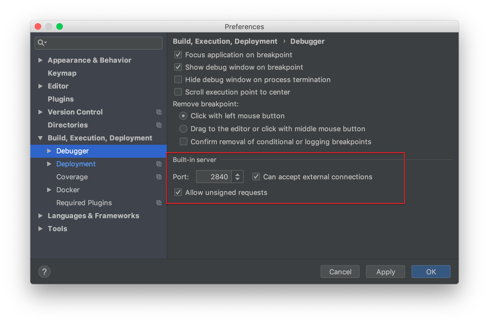
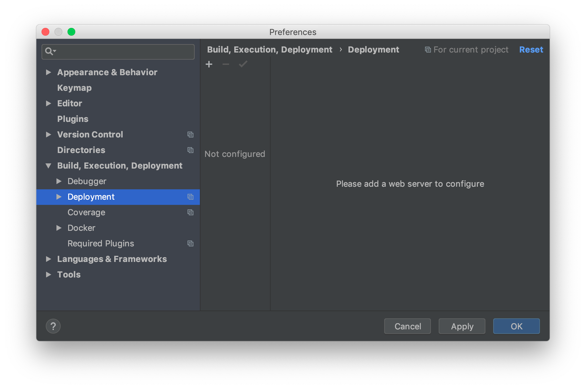
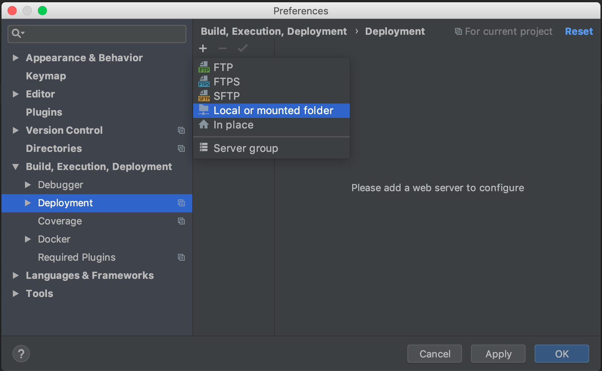
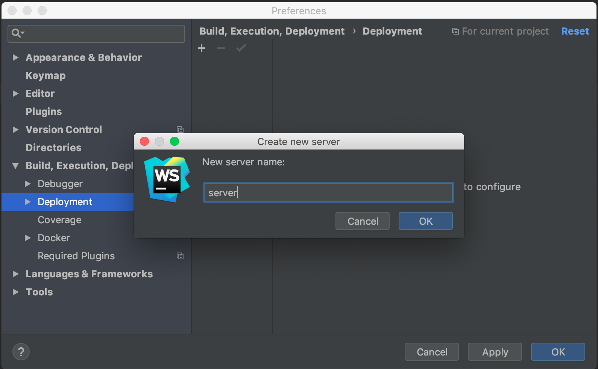
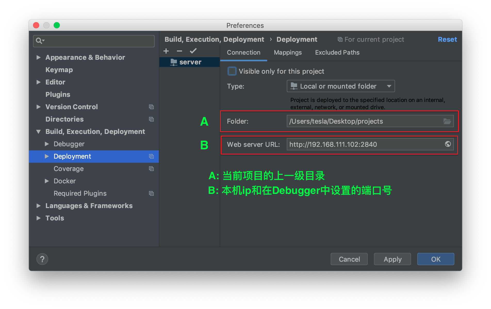
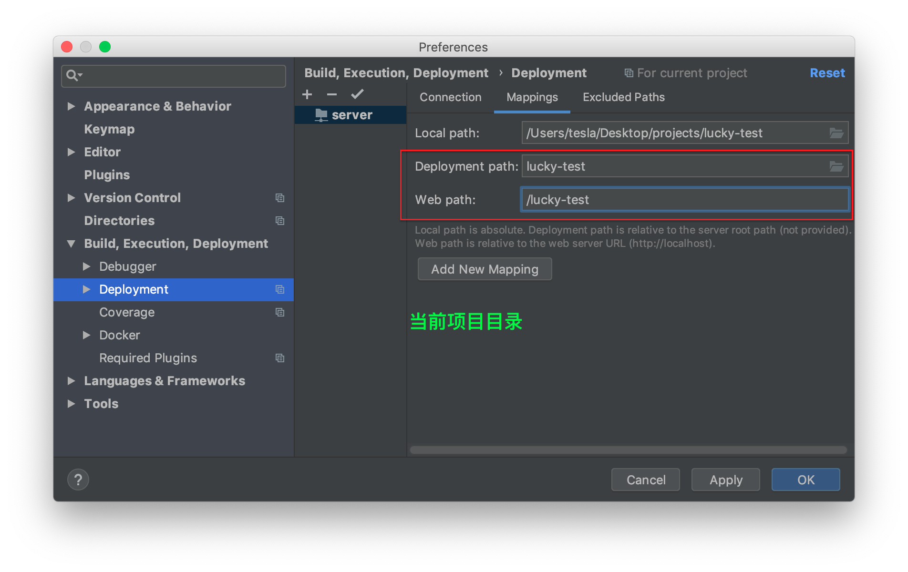

# webStorm设置静态服务器通过局域网访问

1. command + ,打开设置，找到Debugger，设置端口号，勾选两个选项，Apply，如图：  

2. 选择Deployment，如图：  
 

3. 点击右边的"+"号，选中Local or mounted folder，如图：  

4. 在弹出框中输入一个名字，如图：  

5. 在connection项中如图示配置：  

6. 在Mapping项中如图示配置：  

7. Apply OK!